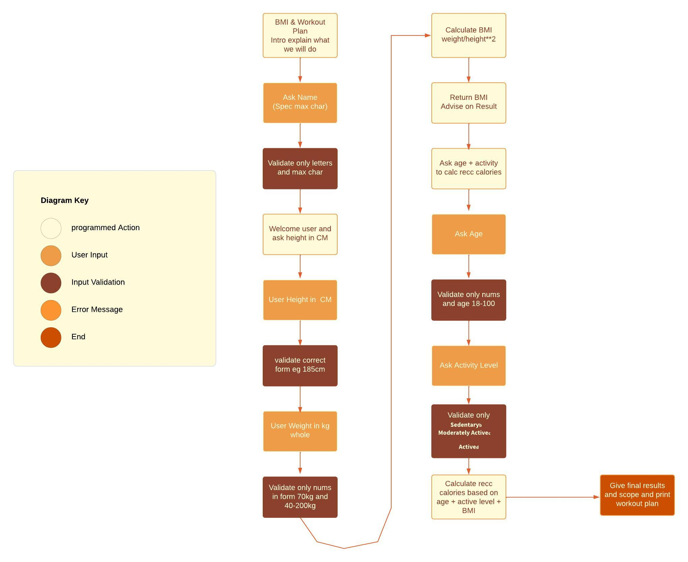
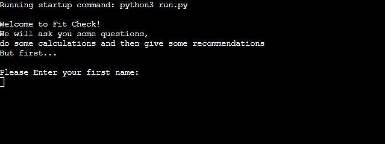
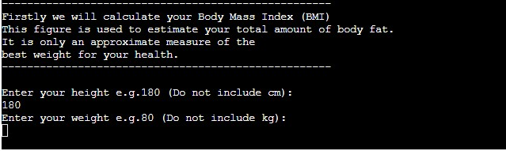
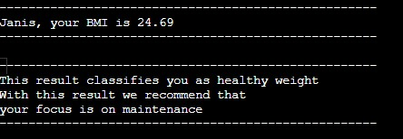
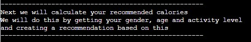
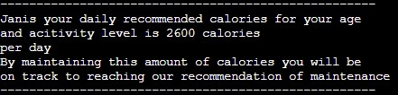
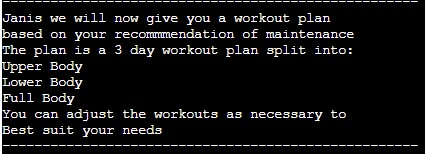
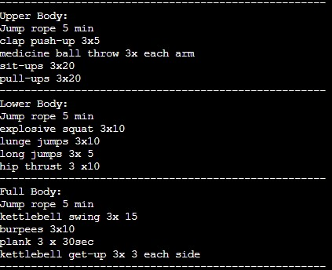

# Fit Check

Fit Check is a fitness checker built using Python. It takes inputs from the user gathering specific data and returns information and recommendations based on the information provided.

The user inputs information throughout the program and their Body Mass Index (BMI) and recommended calories are calculated based on their inputs.

A workout plan is then recommended to them based on their results.

You can view the live site [HERE!](https://fit-check-d4815a99f019.herokuapp.com/)

## UX & Design 

### User Stories

As a user,

* I would like to find out my BMI without having to do any calculations
* I would like to find out my daily recommended calories without having to do any calculations 
* I would like to see errors and reasoning if there is issues with my inputs
* I would like to get a recoommended weekly workout plan that suits my needs

### Logic Flow

To plan the logic flow of the program, a diagram was generated detailing each step of the program. A key is given to distinguish the different types of steps

## Features

### Existing Features

#### Welcome Screen

This screen welcomes the user to the program and advises on what it will do.
Then it asks the user to input their name

#### BMI Section 

This section asks users to input their height and weight and calculates their BMI using these

#### BMI Results Section

When the user inputs their height and weight they are given a bmi result and reccomendation 

#### Recommended Calories Section

This section asks the user their age, gender and activity levels and calculates their recommended daily calories

#### Recommended Calories Results Section

This section calculates and returns the users recommended daily calories 

#### Workout Plan Introduction Section

By using the users recommendation from the bmi section of the project a workout plan is generated for the user 

#### 3 Day Workout Section

Using the users data a 3 day workout plan is generated for the user 

### Features Left to Implement

It would be useful to email the user a copy of the workout plan in order to allow the user to have access to the plan even when they are not running the program.

## Python Libraries Used

### JSON:

Java Script Object Notation was used to import the workout plans from the workouts.json file 

### sys:

sys was used to exit the program at the end if the user chose to end it

## Technologies Used

- Python 

    - Python was used to build the contents and structure of the program

- GitHub
    - GitHub was used to store the source code and also deploy the website on Git Pages

- Git
    - Was used to commit and push code throughout development

- [LucidChart](https://www.lucidchart.com/pages/)
    - Was used to create the flow chart to plan the logic flow of the program

- [Heroku](https://www.heroku.com/)
    - Was used to deploy the program

- [CI Python Linter](https://pep8ci.herokuapp.com/)
    - Was used to validate code throughout the development 

## Testing

For all testing carried out please refer to [TESTING.md](/workspaces/Fit-Check/TESTING.md)

## Deployment 

The program was deployed using Heroku. The live link can be found [HERE!](https://fit-check-d4815a99f019.herokuapp.com/)

Deployment followed these steps:

- Firstly, for inputs to work correctly in the terminal of the deployed program a new line (\n) character was added to each input method.

- If there was any dependencies needed to run the program on Heroku these would need to be updated in the 'requirements.txt' file using the command:
`pip3 freeze > requirements.txt` 

- All these updates must be pushed to GitHub

### Deployment to Heroku

To deploy to Heroku follow these steps:

- Log into the Heroku website
- On the dashboard page click 'New' and then 'Create new app'
- Give your application a name, select the region and click 'Create app'
- Now from the menu on top select 'settings' and 'Reveak Config Vars', in the KEY field enter 'PORT' and the VALUE enter '8000'
- Next select 'Add buildpack' and select 'Python' and 'NodeJS' in that order.
- Now from the menu on top select 'Deploy'
- You can choose to 'Enable Automatic Deploys' or 'Manual Deploy'. Automatic will rebuild the program everytime there is an update pushed to GitHub. This was the selection made for this program
- Once Deployed a link will be on top of the page that you can click saying 'Open App' this will bring you to the live site

### To Clone the Repository Code Locally

- Begin in the required repository
- Click on the green code drop down button and select local
- Copy the repository link to the clipboard
- Using an IDE with pre-installed git type git clone copied-git-url into the IDE terminal
- The project will now be cloned on your IDE to use

## Credits

- [How to use JSON in Python](https://www.youtube.com/watch?v=-51jxlQaxyA&ab_channel=TechWithTim) video was used to understand how to use the workouts.json file 

- [The CDC](https://www.cdc.gov/healthyweight/assessing/index.html) website was used to get the calculationa and information about BMI 

- [Web MD](https://www.webmd.com/diet/calories-chart) was used to get a chart of the required calories